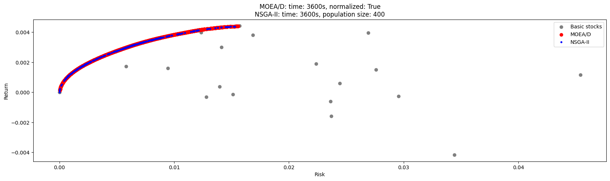
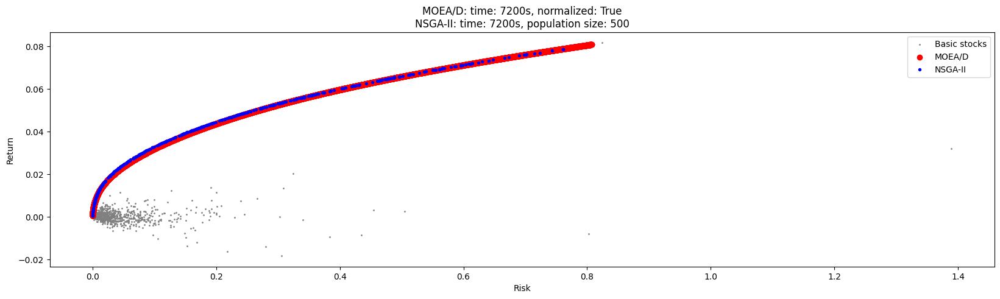

# Optymalizacja Portfela

## Opis projektu
Optymalizacja portfela jest szeroko badaną dziedziną we współczesnych finansach.
Problem optymalizacji polega na znalezieniu optymalnego stosunku między dwoma sprzecznymi celami i.e. ryzykiem i zwrotem. Wraz ze wzrostem liczby aktywów znacznie wzrasta złożoność portfeli, co stanowi wyzwanie obliczeniowe.

Celem projektu jest zbadanie zastosowania algorytmów NMOEA/D (Normalized Multi-Objective Evolutionary Algorithm based on Decomposition) oraz NSGA-II (Non-dominated Sorting Genetic Algorithm) do rozwiązywania tego probelmu.


## Definicja problemu optymalizacji

Rozpatrujemy $n$ spółek: $\mathcal{A}_1, \mathcal{A}_2, \ldots, \mathcal{A}_n$.

*Portfelem* nazywamy wektor $p \in \mathbb{R}^n$, taki że $\sum_{i=1}^n p_i = 1$, definiujący podział kapitału na poszczególne spółki ($p_i$ określa jaką część kapitału inwestujemy w spółkę $\mathcal{A}_i$).

Rozważamy problem optymalizacji dwukryterialnej. Przestrzenią poszukiwań jest zbiór portfeli, natomiast kryteriami, które optymalizujemy są *ryzyko* oraz *oczekiwana stopa zwrotu*.

Oczekiwaną stopę zwrotu portfela $p$ definiujemy jako $r(p) = \sum_{i=1}^n p_i r_i$, gdzie $r_i$ oznacza oczekiwaną stopę zwrotu spółki $\mathcal{A}_i$, którą definiujemy jako średnią stopę zwrotu tej spółki z ostatnich $\Delta t$ dni.

Jako miarę ryzyka przyjmujemy *semiwariancję* stóp zwrotu portfela z ostatnich $\Delta t$ dni.
Semiwariancję wektora $\displaystyle X \in \mathbb{R}^d$ definiujemy jako $\frac{1}{d} \sum_{X_i < \bar{X}} (X_i - \bar{X})^2$.

## Opis algorytmów

### NSGA-II
#### Operatory ewolucyjne
- `single_point_crossover`

    Od klasycznego różni się tylko tym, że potomek jest przeskalowany, tak żeby sumował się do 1.

- `differential_crossover`

    Z trzech osobników $x_1, x_2, x_3$ generujemy nowego osobnika $y = x_1 + F(x_2 - x_3)$, gdzie $F \in (0,1)$ jest pewną stałą.

- `change_pair_mutation`

    Wybieramy losowo dwie pozycje $i,j$ oraz pewne zaburzenie $\delta$.
    Z osobnika $x$ generujemy $x^\prime$, gdzie $x_i^\prime = x_i + \delta$, $x_j^\prime = x_j - \delta$.

- `swap_mutation`

    Zamieniamy miejscami dwie losowo wybrane pozycje.

### MOEA/D
#### Idea algorytmu

Algorytm ten opiera się na dekompozycji wielowymiarowej funkcji celu na kilka funkcji jednowymiarowych, które są równolegle optymalizowane.
W tym celu dla równomiernie rozłożonych wektorów wagowych $\lambda^i$ definiujemy rodzinę funkcji

$$g(x | \lambda, z) = \max_{1 \leq j \leq m}\{\lambda_j |f_j(x) - z_j |\}$$


gdzie $m$ to liczba kryteriów, $f_j$ to $j$-ta funkcja celu, $\lambda$ to wektor wagowy, $z$ to punkt referencyjny.

Punkt referencyjny definiujemy jako $z_i = \min f_i$ (zakładamy, że celem jest minimalizacja $f_i$). Punkt ten będziemy estymować w każdej iteracji korzystając z obecnie znalezionych minimalnych wartości funkcji celu.

Celem algorytmu jest minimalizacja funkcji $g(x | \lambda^i, z)$ dla wszystkich $i$ równolegle.

#### Algorytm

Oznaczenia:
- $N$ - rozmiar populacji (liczba wektorów wagowych)
- $T$ - rozmiar sąsiedztwa
- $P$ = $\{\lambda^1, \lambda^2, \ldots, \lambda^N\}$ - zbiór wektorów wagowych.

Algorytm będzie utrzymywał populację $X = \{x^1, x^2, \ldots, x^N\}$, gdzie $x^i$ to najlepsze znalezione rozwiązanie dla funkcji $g(x | \lambda^i, z)$, oraz zbiór punktów niezdominowanych $Y$.

1. Inicjalizacja
    - $X \leftarrow$ losowa populacja
    - Obliczamy odległości pomiędzy wektorami wagowymi
    - Dla $i \in \{1,2,\ldots,N\}$ wyznaczmy zbiory $B(i) = \{i_1, i_2, \ldots, i_T\}$, takie że $\lambda^{i_1}, \lambda^{i_2}, \ldots, \lambda^{i_T}$ stanowią $T$ najbliższych wektorów dla $\lambda_i$ (sąsiedztwo)
    - $Y \leftarrow \emptyset$
    - inicjalizujemy $z$

2. Aktualizacja populacji
    - dla każdego $i \in \{1,2,\ldots,N\}$:
        - wybieramy losowo $k,l \in B(i)$
        - generujemy osobnika $y$ z $x^k$ i $x^l$ za pomocą operatora krzyżowania
        - mutujemy $y$ (z pewnym prawdopodobieństwem)
        - dla każdego $j \in B(i)$ zastępujemy $x^j$ przez $y$ w populacji $X$, jeśli $g(y | \lambda^j, z) < g(x^j | \lambda^j, z)$
        - jeśli $y$ nie jest dominowany przez żaden $x \in Y$, to $Y \leftarrow Y \cup \{y\}$
        - usuwamy z $Y$ wszelkie elementy zdominowane przez $y$
        - aktualizujemy $z$

3. Jeśli zajdzie warunek końcowy - zakończ, jeśli nie - powtórz krok 2.

#### Operatory ewolucyjne
- `single_point_crossover`

    Tak jak w NSGA-II.

- `arithmetic_crossover`

    Z dwóch osobników $x_1, x_2$ generujemy nowego osobnika $y = \alpha x_1 + (1-\alpha)x_2$, gdzie $\alpha \in (0,1)$ jest pewną stałą.

- `differential_crossover`

    Z dwóch osobników $x_1, x_2$ generujemy nowego osobnika $y = x_1 + \alpha(x_1 - x_2)$, gdzie $\alpha \in (0,1)$ jest pewną stałą.

- `change_pair_mutation`

    Tak jak w NSGA-II.

- `swap_mutation`

    Tak jak w NSGA-II.

## Opis implementacji

### Użyte narzędzia

Projekt zaimplementowany jest w języku python z użyciem bibliotek numpy, pandas, matplotlib.

### Jak liczyć semiwariancję portfeli

Niech $X \in \mathbb{R}^{M \times n}$ oznacza populację, każdy wiersz to osobnik (portfel) - wektor $n$-wymiarowy.

Niech $L$ - stopy zwrotu poszczególnych spółek w poszczególnych dniach, element $L_{i,j}$ ($i$-ty wiersz, $j$-ta kolumna) to zwrot $j$-tej spółki w dniu $t_i$.
Macierz $L$ jest wymiaru $\Delta t \times n$.

Stąd macierz $R = XL^T$ ma na pozycji $R_{i,j}$ iloczyn skalarny $i$-tego wiersza $X$ z $j$-tą kolumną $L^T$, czyli $j$-tym wierszem $L$. Jest to zatem iloczyn skalarny $i$-tego portfela z wektorem stóp zwrotu poszczególnych spółek w dniu $t_j$, czyli zwrot $i$-tego portfela w dniu $t_j$.

Tak więc $i$-ty wiersz macierzy $R$ zawiera stopy zwrotu całego $i$-tego portfela w kolejnych dniach. Zatem licząc semiwariancję każdego wiersza tej macierzy, otrzymujemy semiwariancję dla każdego portfela (osobnika w populacji $X$) - czyli jego funkcję ryzyka.

Taki sposób liczenia semiwariancji umożliwia efektywną implementację z użyciem operacji macierzowych w bibliotece numpy.

## Wyniki

Eksperymenty przeprowadziliśmy dla dwóch przypadków:
20 spółek z WIG20 oraz dla większej ilości spółek (851).
Eksperymenty te różniły się doborem parametrów oraz czasem obliczeń.

Dla obu algorytmów eksperymentalnie wyznaczyliśmy parametry, przy których uzyskiwane były najlepsze wyniki. Parametry te zostały wykorzystane w ostatecznym eksperymencie, porównującym efektywność obu algorytmów.

### WIG20

W tym eksperymencie ustawiliśmy maksymalny czas obliczeń dla obu algorytmów na 1 godzinę.


#### Parametry
```python
moead_kwargs={'max_time': 3600,
              'weight_vectors': default_weight_vectors(120),
              'neighborhood_size': 20,
              'mutation_probability': 0.16,
              'normalize': True,
              'crossover_operator': moead_operators.differential_crossover,
              'mutation_operator': moead_operators.change_pair_mutation},

nsga2_kwargs={'population_size': 400,
              'number_of_offspring': 800,
              'max_time': 3600,
              'crossover_probability': 0.9,
              'mutation_probability': 0.2,
              'crossover_operator': nsga2_operators.single_point_crossover,
              'mutation_operator': nsga2_operators.swap_mutation,
              'alpha': 0.75}
```

#### Wynik


### 851 spółek

W tym eksperymencie ustawiliśmy maksymalny czas obliczeń dla obu algorytmów na 2 godziny.

#### Parametry
```python
moead_kwargs={'max_time': 7200,
              'weight_vectors': default_weight_vectors(100),
              'neighborhood_size': 50,
              'mutation_probability': 0.16,
              'normalize': True,
              'crossover_operator': moead_operators.differential_crossover,
              'mutation_operator': moead_operators.swap_mutation},

nsga2_kwargs={'population_size': 500,
              'number_of_offspring': 1000,
              'max_time': 7200,
              'crossover_probability': 0.95,
              'mutation_probability': 0.25,
              'crossover_operator': nsga2_operators.differential_crossover(),
              'mutation_operator': nsga2_operators.swap_mutation,
              'alpha': 0.75}
```

#### Wynik


## Wnioski

Wyniki otrzymane przez rozważane algorytmy są porównywalne pod względem wartości funkcji celu. Rozwiązanie znalezione przez MOEA/D zawiera jednak więcej punktów, w związku z czym daje bardziej spójne przybliżenie prawdziwego frontu Pareto.
